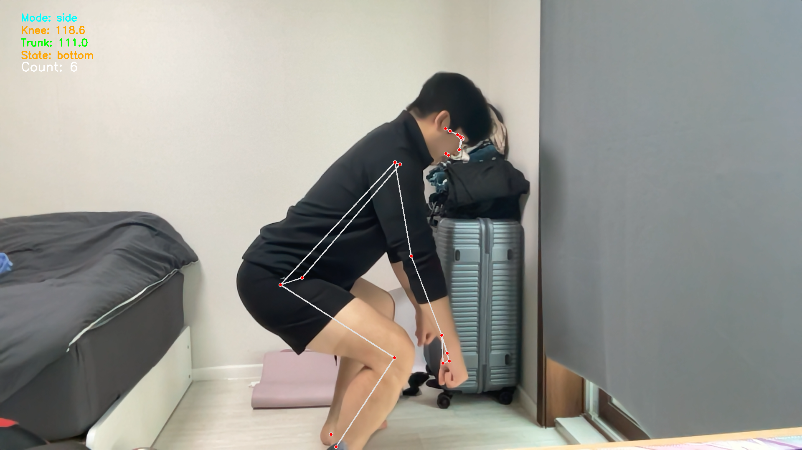
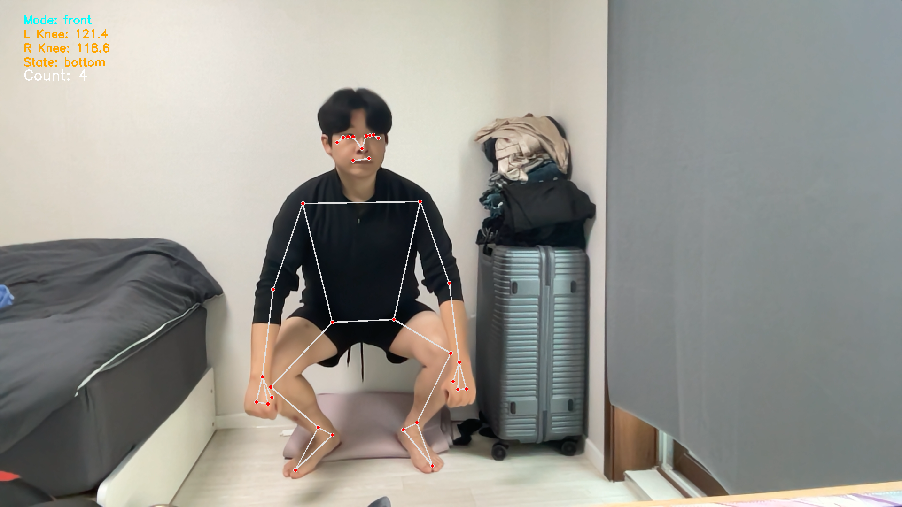
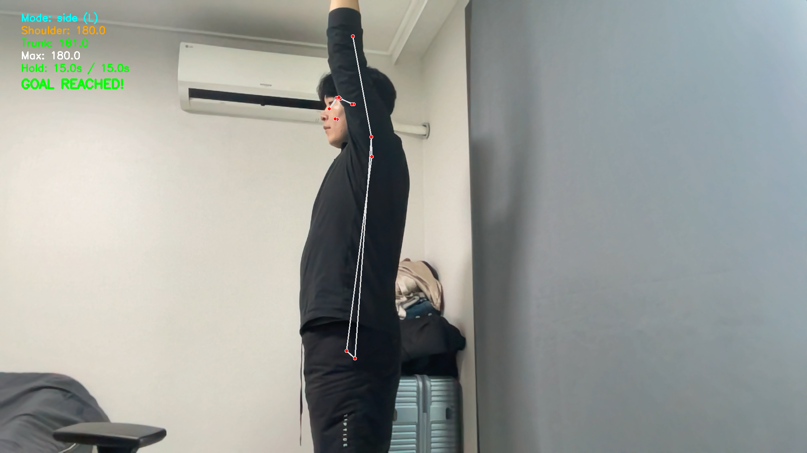
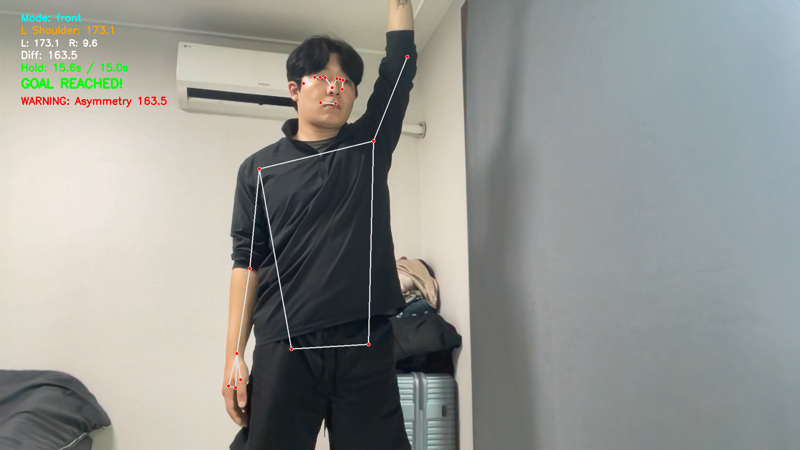
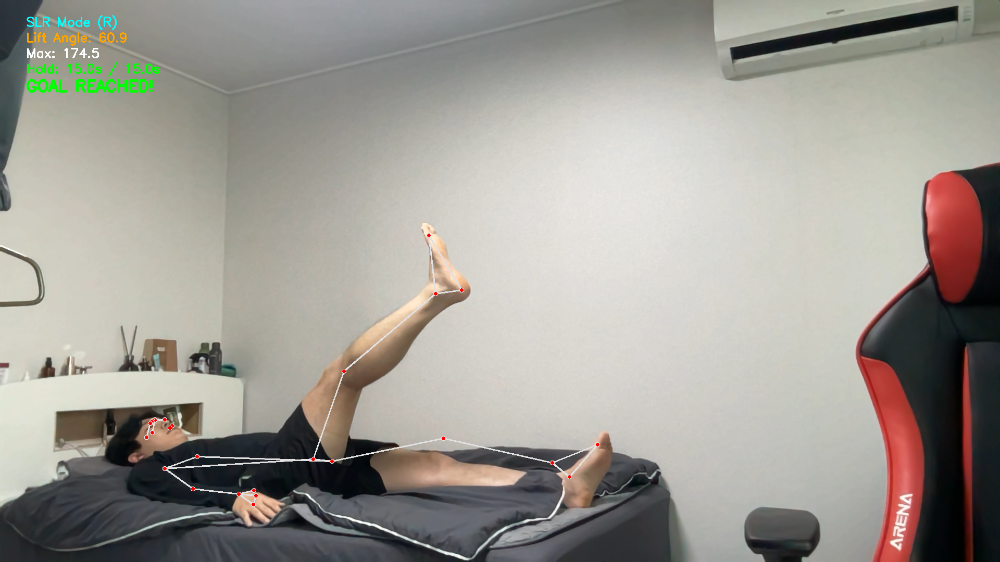
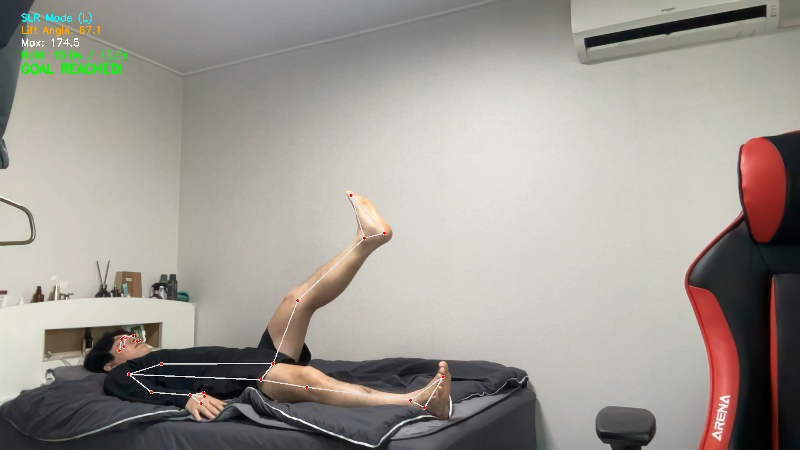

# 🏃 Motion Analysis
### 물리치료 임상 경험 기반 재활운동 AI 동작평가 시스템

물리치료사 5년 임상 경험을 바탕으로 개발한 MediaPipe 기반 실시간 동작분석 시스템.
재활 단계별 운동(스쿼트 / Shoulder Ladder / SLR)을 AI로 자동 평가한다.

---

## 📌 프로젝트 배경

> "사람마다 하체 길이가 다르기 때문에 정해진 각도 기준보다
> 개인별 패턴 변화와 좌우 비대칭을 보는 것이 더 중요하다"

5년간 물리치료사로 일하며 재활 현장에서 직접 수행하던 동작평가를 AI로 구현했다.
단순한 각도 측정이 아닌, 임상 프로토콜 기반으로 설계했다.

---

## 🗂️ 재활 단계별 구성

| 단계 | 운동 | 이유 |
|------|------|------|
| 초기 재활 | SLR (Straight Leg Raise) | 요구 신체 능력이 낮아 재활 초기에 적합 |
| 중기 재활 | Shoulder Ladder | 수동적 어깨 굴곡으로 관절 가동범위 회복 |
| 후기 재활 | Squat | 발목·고관절·대퇴사두근 Eccentric 수축 필요 |

---

## ✅ 구현 기능

### 1️⃣ Squat Analyzer (`scripts/squat_analyzer.py`)

| 기능 | 설명 |
|------|------|
| 정면/측면 자동 감지 | 어깨 x좌표 차이로 카메라 방향 자동 인식 |
| 무릎 굴곡각도 측정 | 고관절-무릎-발목 코사인 법칙 |
| 좌우 비대칭 감지 | 15도 이상 차이 시 WARNING |
| 체간 앞쏠림 감지 | 50도 미만 시 WARNING |
| 동작 단계 자동 인식 | standing / descending / bottom / ascending |
| 횟수 자동 카운팅 | 최저점 → 기립 완료 시 1회 카운트 |
| 최저점 자동 캡쳐 | 정면/측면 구분하여 results 폴더에 자동 저장 |

**단계별 색상 피드백**

| 단계 | 색상 |
|------|------|
| standing | 초록 |
| descending | 노랑 |
| bottom | 주황 |
| ascending | 하늘 |

### 2️⃣ Shoulder Ladder (`scripts/shoulder_ladder.py`)

| 기능 | 설명 |
|------|------|
| 정면/측면 자동 감지 | 어깨 x좌표 차이로 자동 전환 |
| 측면 - 어깨 굴곡각도 | 손목-어깨-엉덩이 코사인 법칙 |
| 측면 - 좌우 자동 감지 | 올라간 팔 자동 인식 (L/R) |
| 측면 - 체간 보상 감지 | 150도 미만 시 WARNING |
| 측면 - 최대각도 갱신 | 세션 중 최대 굴곡각도 추적 |
| 정면 - 수평 외전각도 | 양팔 각도 + 좌우 비대칭 비교 |
| 정면 - Trunk Sidebending | 어깨 y좌표 차이로 감지 |
| 15초 타이머 | 목표 달성 시 소리 알림 + GOAL REACHED |
| 자동 캡쳐 | GOAL REACHED 시 자동 저장 |

### 3️⃣ SLR Analyzer (`scripts/slr_analyzer.py`)

| 기능 | 설명 |
|------|------|
| 들어올린 다리 자동 감지 | 엉덩이 대비 발목 높이 차이로 L/R 판단 |
| 들어올린 각도 측정 | 어깨-엉덩이-발목 기준 |
| 최대각도 갱신 | 세션 중 최대 들어올린 각도 추적 |
| 15초 타이머 | 30도 이상 유지 시 타이머 시작 |
| 소리 알림 | 15초 달성 시 알림음 |
| 골반 안정성 감지 | 양쪽 엉덩이 y좌표 차이로 Pelvis Tilt 감지 |
| 자동 캡쳐 | GOAL REACHED 시 L/R 구분하여 자동 저장 |

---

## 📸 결과 예시

### Squat - 측면 최저점

```
Mode: side / Knee: 118.6 / Trunk: 111.0
State: bottom / Count: 6
```

### Squat - 정면 최저점

```
Mode: front / L Knee: 121.4 / R Knee: 118.6
State: bottom / Count: 4
```

### Shoulder Ladder - 측면 GOAL REACHED

```
Mode: side (L) / Shoulder: 180.0
Hold: 15.0s / 15.0s / GOAL REACHED!
```

### Shoulder Ladder - 정면 GOAL REACHED

```
Mode: front / L Shoulder: 173.1
Hold: 15.6s / 15.0s / GOAL REACHED!
```

### SLR - 오른쪽 GOAL REACHED

```
SLR Mode (R) / Lift Angle: 59.7
Hold: 15.0s / 15.0s / GOAL REACHED!
```

### SLR - 왼쪽 GOAL REACHED

```
SLR Mode (L) / Lift Angle: 67.1
Hold: 15.0s / 15.0s / GOAL REACHED!
```

---

## 💡 임상 인사이트

**스쿼트는 재활운동 치고 요구 능력이 높다**

발목 안정성, 고관절 힌지, 호흡, 대퇴사두근 Eccentric 수축을 느낄 줄 알아야 한다.
그래서 무릎 재활 초기에는 스쿼트보다 SLR을 먼저 시작한다.

**15초 유지가 스트레칭의 최소 기준**

임상에서 스트레칭은 최소 15초를 유지해야 근육과 관절에 실질적인 효과가 있다.
모든 운동에 15초 타이머를 적용한 이유다.

**데이터 품질이 결과를 결정한다**

발목이 가려지거나 전신이 안 보이면 랜드마크 추정 오류로 잘못된 각도가 나온다.
입력 환경 표준화가 정확도의 핵심이다.

---

## 🗂️ 프로젝트 구조

```
motion-analysis/
├── data/
│   └── raw/                    # 입력 영상 (gitignore)
├── scripts/
│   ├── pose_detection.py       # MediaPipe 기초
│   ├── angle_calculator.py     # 관절각도 계산
│   ├── squat_analyzer.py       # 스쿼트 분석
│   ├── shoulder_ladder.py      # 어깨 사다리 분석
│   ├── slr_analyzer.py         # SLR 분석
│   └── video_analyzer.py       # 영상 파일 분석
├── results/                    # 분석 결과 이미지
└── README.md
```

---

## 🛠️ 기술 스택

| 항목 | 내용 |
|------|------|
| Language | Python 3.10 |
| Pose Estimation | MediaPipe 0.10.9 |
| Image Processing | OpenCV |
| Numerical | NumPy |

---

## ⚙️ 실행 방법

```bash
# 환경 세팅
conda activate motion-env

# 스쿼트 분석
python scripts/squat_analyzer.py

# 어깨 사다리 분석
python scripts/shoulder_ladder.py

# SLR 분석
python scripts/slr_analyzer.py

# 영상 파일 분석
python scripts/video_analyzer.py

# 단축키
# s → 현재 화면 즉시 저장
# q → 종료
```

---

## 📊 측정 항목 전체 요약

| 운동 | 모드 | 측정 항목 | 경고 기준 |
|------|------|-----------|-----------|
| Squat | 정면 | 좌우 무릎 각도 | 차이 15도 이상 |
| Squat | 정면/측면 | 동작 단계 + 횟수 | - |
| Squat | 측면 | 무릎 굴곡각도 | - |
| Squat | 측면 | 체간 앞쏠림 | 50도 미만 |
| Shoulder | 측면 | 어깨 굴곡각도 + 체간 보상 | 150도 미만 |
| Shoulder | 측면 | 15초 타이머 | GOAL REACHED |
| Shoulder | 정면 | 수평 외전각도 + 좌우 비대칭 | 15도 이상 |
| Shoulder | 정면 | Trunk Sidebending | 어깨 높이 차이 |
| Shoulder | 정면 | 15초 타이머 | GOAL REACHED |
| SLR | 측면 | 들어올린 각도 + 골반 안정성 | Pelvis Tilt |
| SLR | 측면 | 15초 타이머 | GOAL REACHED |

---

## 🔜 다음 단계

- PoseFormer 논문 구현 (동작분석 + Transformer)
- 운동별 세션 리포트 자동 생성
- 좌우 비교 그래프 시각화
